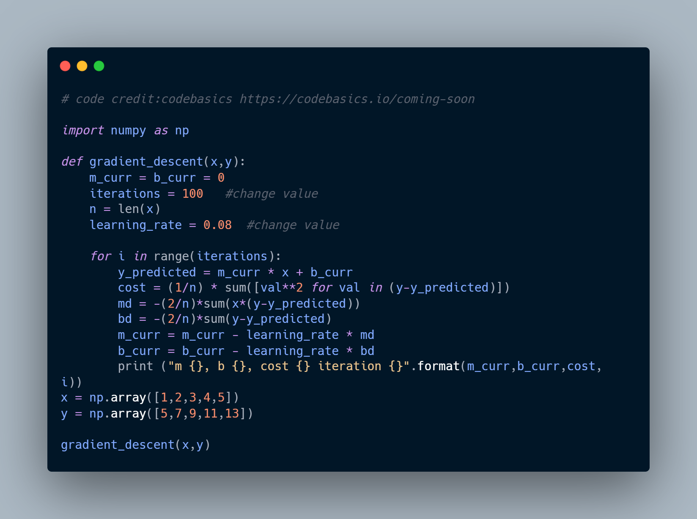

# E-Portfolio Activity: Gradient Cost Function

The gradient descent loss function helps train models by minimising the difference between predictions and actual values. It calculates the gradient of the loss and updates parameters step by step in the direction that reduces the loss, aiming for the minimum value (Tapkir, 2023).

In this exercise, I was tasked with calculating cost using gradient descent and learning rate by adjusting iteration and learning rate values to observe their impact on the cost function. The objective was to reach the minimum cost efficiently, using the optimal combination of iterations and learning rate.

##Initial Observations

Starting with a learning rate of 0.08 and 100 iterations, the algorithm achieved a cost of 0.0041.

## Learning Rate Exploration

I decided to experiment with different learning rates to observe their impact on cost. Initially, I reduced the learning rate to 0.05, which caused the cost to increase to 0.0321. Lowering it further to 0.02 led to a sharp rise in cost to 0.2451, indicating that reducing the learning rate was not an effective solution for minimising cost. Next, I increased the learning rate to 0.09, but the cost exploded to 2,640,508,310,116.11, confirming that an excessively high learning rate caused instability. These experiments validated that a learning rate of 0.08 was the most effective choice for this number of iterations.

## Iteration Optimisation

With the learning rate set to 0.08, I explored various iteration counts to find the optimal number. Reducing the iterations to 90 and then 80 increased the cost, so I decided to increase the number of iterations instead. At 130 iterations, the cost dropped to 0.0008, showing significant improvement. Continuing in this direction, I increased the iterations to 160, where the cost achieved its lowest value of 0.00015. Further increasing the number of iterations beyond 160 led to a rise in cost, confirming that 160 iterations was the optimal balance for minimising cost effectively. Attempts to adjust the learning rate at this point, either higher or lower, also resulted in increased costs.

## Conclusion

The experiments confirmed that a learning rate of 0.08 combined with 160 iterations was the optimal configuration, achieving the lowest cost efficiently and effectively.

References: 

Tapkir, A., (2023). A comprehensive overview of gradient descent and its optimization algorithms.  ResearchGate. Available at: https://www.researchgate.net/publication/375853994_A_Comprehensive_Overview_of_Gradient_Descent_and_its_Optimization_Algorithms (Accessed 22 Jan. 2025)
