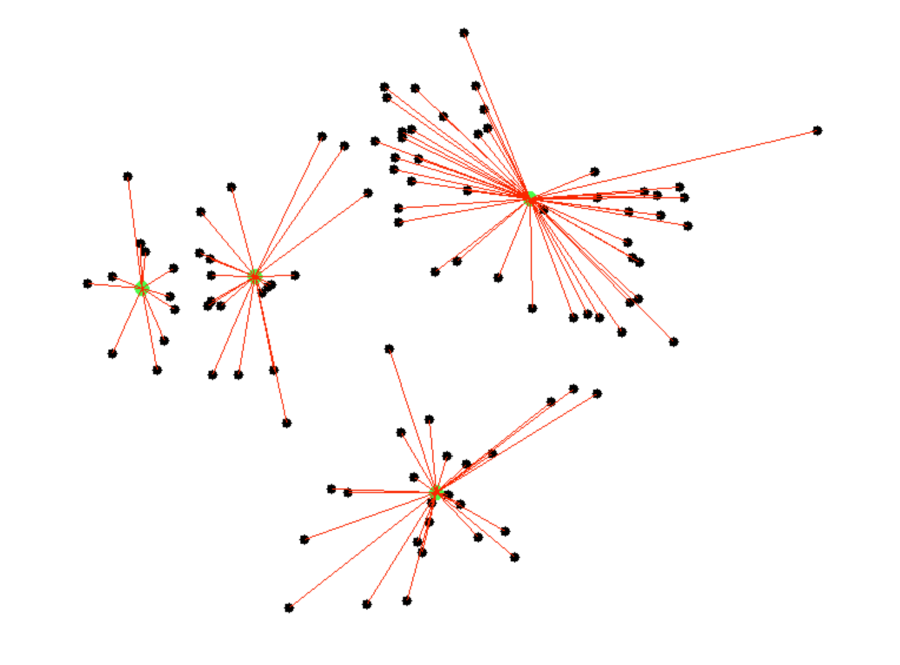
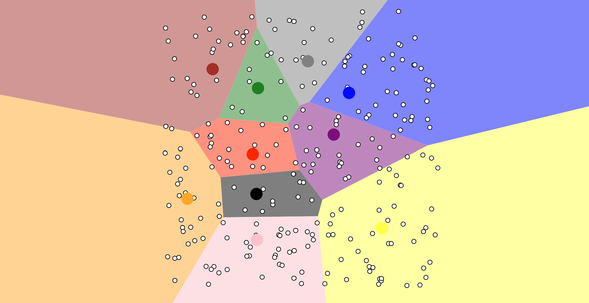

# Wiki Activity : Clustering

K-Means clustering is a method used to group similar data points into clusters. It works by dividing data into a set number of groups, called K, where each group has similar characteristics.  As an unsupervised learning algorithm, it identifies patterns in data without requiring predefined labels or categories, making it useful for exploring unknown data structures (Sinaga and Yang, 2020).

The **Shabal.in** animation demonstrates all the steps of the K-Means clustering algorithm:

Step 1: Initialization

Green points represent the initial centroids, while black points are the data to be grouped. 

Step 2: Assignment

Data points are assigned to the nearest centroid, shown by red lines.

Step 3: Update

Centroids move to new positions, calculated as the average of their assigned points.

Step 4: Reassignment

Data points reassign to the closest centroid after updates.

Step 5: Iteration

Assignment and updates repeat until centroids stabilise.

Step 6: Final Clustering

Centroids connect to distinct groups of points, forming stable cluster

**Naftali Harris'** animation takes a different approach, allowing the user to choose where to place centroids themselves. This animation is a great example of how the logic of centroid placement influences clustering performance and highlights the critical role of careful initialisation, as poorly placed centroids, like those seen in the image, result in unbalanced clusters, where some clusters dominate in size while others remain small and underrepresented. This can lead to the clustering failing to capture the true structure of the dataset, causing inaccurate or misleading results.

The key takeaway from analysing both animations is that, while the algorithm can adjust centroid positions during clustering, the initial placement of centroids is crucial, as poor initialisation can significantly impact the results.

References:

Harris, N., (2014). Visualizing K-Means Clustering. Available at: https://www.naftaliharris.com/blog/visualizing-k-means-clustering/ (Accessed 23 January 2025)

Shabal, (n.d.) K-Means Clustering Visualisation. Available at: https://shabal.in/visuals/kmeans/2.html (Accessed 23 January 2025).

Sinaga, K.P. and Yang, M.-S., (2020). Unsupervised K-Means Clustering Algorithm. IEEE Access, 8, pp.80716-80727. Available at: https://doi.org/10.1109/ACCESS.2020.2988796 (Accessed 23 Jan. 2025).

  <a href="https://dzervenes.github.io/" class="back-button">Back</a>

